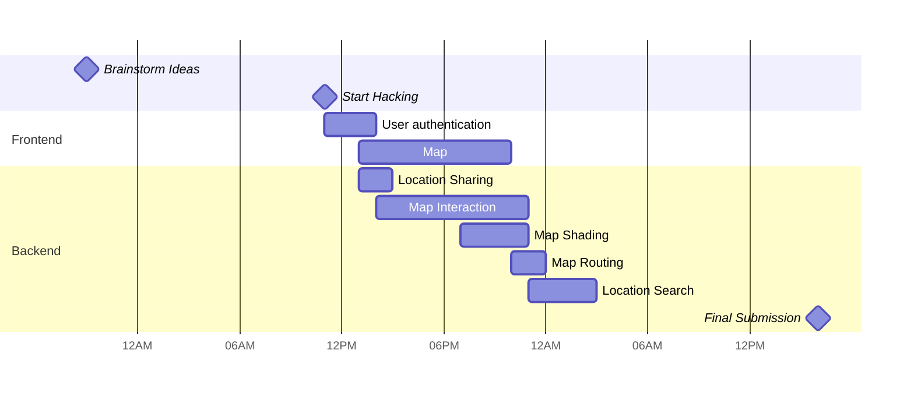

Awesome App
===
<!-- 


 -->
 
:::success
Welcome! Thank you for visiting our page.
It is a mobile application created by 4 passionate women engineering students to elevate women's safety.

Submitted to Black Wings Hack 2024 as a team `Illution of Greatness`


Contributed by [Alina](https://www.linkedin.com/in/alina-erofeeva-minerva), [Erela](https://linkedin.com/in/erela-yang-snow), [Ivanna](https://www.linkedin.com/in/ivanna-kreshchenetska/), & [Polina](https://www.linkedin.com/in/polina-vishnevskaya/) with <33
:::

**Table of Contents**

[TOC]

## How to use our product
There are following two ways to check our product
- A: Clone repository
- B: Access Expo Go website

**A: Clone repository**
1. Clone our repository
2. `npm install` to install dependencies
3. Install `ExpoGo` from App Store
4. `npx expo start`

**B: Access Expo Go website**

User flows
---

In the following user flows, we show 
- the user registration process (Numbered `1-4`)
- 2 features
    - A: Safety level check upon location search
    - B: Check route to the closest safe spot when you're in danger

```sequence
User->OUR APP: 1. Register App

Note right of OUR APP: 2. Store user info & emergency contacts

OUR APP->User: 3. Ask location sharing

User ->OUR APP: 4. Share Location

User--> OUR APP: A.Check the safety of area

Note right of OUR APP: (Render Google Map)

User--> OUR APP: B1. Check routes to the safe spot nearby

OUR APP-->Google Map: B2. Redirect users for routing
```

Project Timeline
---



Future Ideas
---
If we have more time to develop, here are some  features we find meaningful to implement on top of the current version.
- widget on mobile devices to activate the nearest safe location search
- call car-sharing application/taxi to pick up when you're in danger
- motion tracker with Machine Learning


## Appendix and FAQ