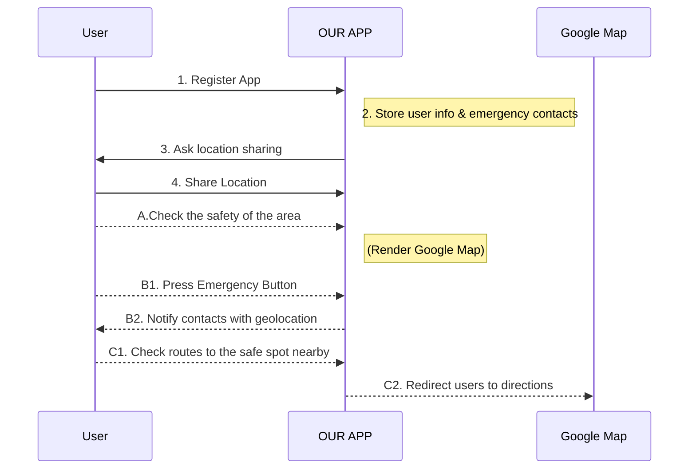
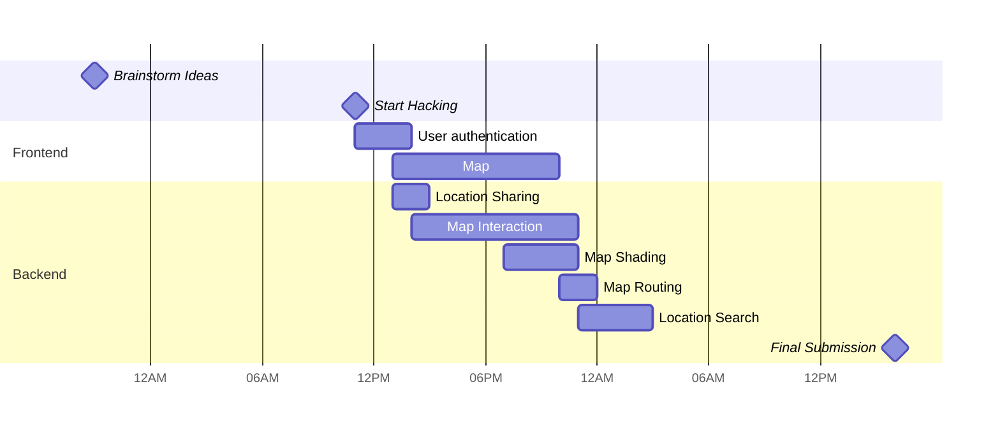

Guardianess
===
<!-- 


 -->
 
:tada:	Welcome! Thank you for visiting our page!

"Guardianess" is a mobile application created by 4 passionate female engineering students to elevate women's safety. In our personal experience, we did not feel particularly safe on the streets of San Francisco, US. There is no application with centralized information about safety and tangible sources on where to go in a dangerous situation.

In an emergency scenario, one is likely to panic and feel frightened. The application provides a sense of assurance when navigating through the streets, provides a tangible sense of security, and potentially could save lives in an emergency. 

Submitted to Black Wings Hack 2024 as a team `Illusion of Greatness`


Contributed by [Alina](https://www.linkedin.com/in/alina-erofeeva-minerva), [Erela](https://linkedin.com/in/erela-yang-snow), [Ivanna](https://www.linkedin.com/in/ivanna-kreshchenetska/), & [Polina](https://www.linkedin.com/in/polina-vishnevskaya/) with :heartpulse:.

**Table of Contents**

- [User Story](#User-story)
- [How to use our application](#How-to-use-our-app)
- [User Flows](#User-flows)
- [Project Timeline](#Project-timeline)
- [Future Directions](#Future-directions)
- [Appendix and FAQ](#Appendix-and-FAQ)

## User story
---
```gherkin=
Feature: Check how safe a location is

  Scenario: User wants to visit a new location
    Given I'm a logged-in User
    When I go to the Main page
    And I search for a location
    Then I see the safety score of the location
    And receive advice on safety measures
```

```gherkin=
Feature: Send an emergency signal to chosen contacts
  Scenario: User is in a dangerous situation
    Given I'm a logged-in User
    When I go to the Main page
    And I click "Emergency" for 3 seconds
    Then my chosen contacts are notified about an emergency 
    with my geolocation  
    And I receive directions to the closest safe place
```
```gherkin=
Feature: Find the closest safe location

  Scenario: User feels unsafe
    Given I'm a logged-in User
    When I go to the Main page
    And I click on any of the bookmarked safe places
    Then the app calculates the route
    And I see the route information on Google Maps
```


## How to use our app

If you are a total beginner to this, start here!

1. Clone our repository `git clone <url>`
2. `npm install` to install dependencies
3. Install `ExpoGo` from App Store/Play Market
4. Run`npx expo start` to build the app
5. Scan the QR code with a camera (iOS) or ExpoGo (Android)


## User flows
---

In the following user flows, we show 
- the user registration process (Numbered `1-4`)
- 3 features
    - A: Safety level check upon location search
    - B: Emergency button press
    - C: Check the route to the closest safe spot when you're in danger



## Project Timeline
---
The times provided are in GMT.



## Future Directions
---

If we have more time to develop, here are some  features we find meaningful to implement on top of the current version.
- Expansion to more cities across the US and beyond
- Community features
- Widget on mobile devices to activate the nearest safe location search
- Call a car-sharing application/taxi to pick you up when you're in danger
- Motion tracker empowered by Machine Learning


## Appendix and FAQ

:information_source:	**Find this document incomplete?** Leave a comment!
